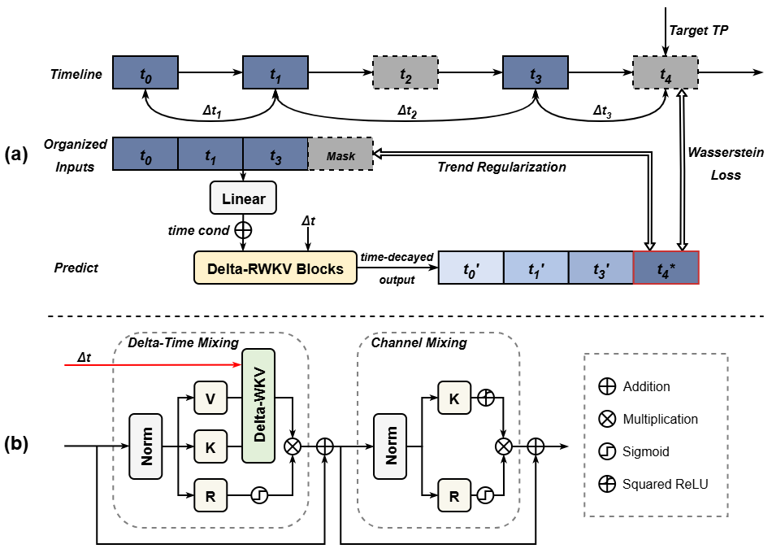

# scMix: Learning Temporal Dynamics of Gene Expression under Irregular Time Intervals


<p style="font-size:12px;">
We introduce scMix, a time-aware modeling framework that integrates information from multiple earlier timepoints, enabling the use of richer temporal information. Moreover, scMix proposes a delta-time mechanism that allows the model to bypass unmeasured timepoints, reducing error accumulation and improving robustness. scMix demonstrates state-of-the-art performance in predicting gene expression at unmeasured timepoints, surpassing existing methods, and also achieves outstanding results on downstream tasks.
</p>
---

## Datasets

We use four benchmark single-cell time-series datasets from four different species:

| Dataset            | Species                     | #Cells  | #Time Points | Source |
|---------------------|-------------------------------|---------|-------------|--------|
| Zebrafish Embryo    | *Danio rerio*               | 38,731  | 12          | [Single Cell Portal (SCP162)](https://singlecell.broadinstitute.org/single_cell/study/SCP162/single-cell-reconstruction-of-developmental-trajectories-during-zebrafish-embryogenesis) |
| Drosophila          | *Drosophila melanogaster*   | 27,386  | 11          | [GEO: GSE190147](https://www.ncbi.nlm.nih.gov/geo/query/acc.cgi?acc=GSE190147) |
| Schiebinger2019     | *Mus musculus*             | 236,285 | 19          | [Broad Institute WOT Tutorial](https://broadinstitute.github.io/wot/tutorial/) |
| Veres               | *Homo sapiens*             | 51,274  | 8           | [GEO: GSE114412](https://www.ncbi.nlm.nih.gov/geo/query/acc.cgi?acc=GSE114412) |

Detailed dataset information and preprocessing steps can be found in the [`data_preprocessing`](./data_preprocessing).

---

## Getting Started

### Requirements

The required dependencies are listed below. You can install them all with:

```bash
pip install -r requirements.txt

The `requirements.txt` contains:

- deepspeed==0.14.4  
- geomloss==0.2.6  
- matplotlib==3.10.6  
- natsort==8.4.0  
- numpy==2.3.3  
- pandas==2.3.2  
- pytorch_lightning==2.3.0  
- scanpy==1.11.4  
- scikit_learn==1.7.2  
- scipy==1.16.2  
- seaborn==0.13.2  
- torch==2.6.0+cu118  
- umap_learn==0.5.7
